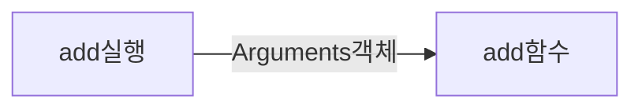
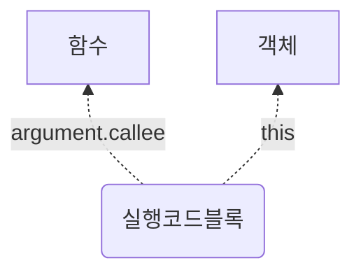

# function 

함수는 자바스크립트에서 가장 중요한 개념 중의 하나인데, 어렵게 느껴지는 이유는 함수가 수행하는 역할이 워낙 많기 때문이다. 


#### 1. 객체로서의 함수

자바스크립트의 모든 함수는 객체 형태를 띄고 있다. 

이 말이 쉽게 납득이 가지 않는 것은, 생긴 모습이 다르기 때문일 것이다. 

```javascript
const obj = {
    a: 1
}

function f() {
    
}
```

어째서 f가 obj와 같은 족속이라고 볼 수 있는 것일까?


우선, 자바스크립트에서 객체가 특별한 것이 아니라는 것을 상기할 필요가 있다. 

Primitive 값이 아닌 모든 것은 객체인 것이다. 

자바스크립트에서, 함수는 [[Call]] 이라는 internal method를 갖는 객체이다.

따라서 함수를 단순히 실행가능한 코드 블럭이라고 보기 보다는,

"실행가능한 코드가 포함된 특수한 타입의 객체 (callable object)"라고 보는 것이 이해하기 편하다. 


- 아래 두 문장의 결과는 완전히 동일하다.

```javascript
function Person(){};
```

```javascript
var Person = new Function();
```

prototype은 객체 중에서도 Function 객체에만 만들어진다. 


#### 2. prototype

함수는 다른 객체와는 달리 prototype이라는 프로퍼티를 가진다.

(예외가 두 가지 있는데, 화살표 함수와 제너레이터 함수에는 prototype이 없다.)


#### 3. 객체 생성기로서의 함수

자바스크립트는 객체지향 언어, 그 중에서도 prototype으로 객체지향을 구현한 언어이다. 

자바스크립트에서의 모든 객체는 함수로 만들어진다. 

(객체 리터럴도 내부적으로는 new Object() 라는 과정을 통해 만들어진다.)


즉, 함수는 객체를 생성하는 필수적인 재료가 되는 것이다.

함수 중에서 prototype 에 constructor 를 갖고 있는 함수는 생성자 함수(객체 인스턴스를 만드는 함수)로 사용이 가능하다. 


#### function vs Function

function 은 일반적인 함수를 나타내고 Function 은 내장객체를 말한다. 

Function 으로 만든 함수는 전역에서 생성된 것과 같이 처리되기 때문에 클로저를 만들지 못한다.


---

본문의 예제 1 ~ 9 까지의 내용은 책(자바스크립트 객체지향 프로그래밍)을 공부하고 정리한 내용이다.


## 1. 자바스크립트 함수의 역할

자바스크립트는 단순히 클래스의 메서드 정도의 기능 뿐만 아니라, 훨씬 다양한 기능을 수행한다. 

함수의 역할을 살펴보면 아래와 같이 **3가지 기능**으로 볼 수 있다. 

- 호출 가능한 루틴으로서의 함수
- 값으로서의 함수
  - 인자로 전달 가능
  - 변수에 할당 가능
  - 다른 함수의 반환값으로 할당 가능
- 다른 인스턴스를 생성할 수 있는 요소, 즉 객체타입으로서의 함수

우리가 함수를 정의하면 위에서 정의한 역할을 모두 수행할 수 있는 구조가 메모리에 정의된다. 


## 2. 함수 모델링

자바스크립트는 컴파일을 먼저 수행하고나서 실행을 한다. 

```javascript
function add(x, y){
    return x + y;
}
```

위와 같은 함수가 정해지면, 자바스크립트는 우선 컴파일을 실행을 하게 되는데 아래와 같은 구조로 구성된다. 

(아래는 자바스크립트 객체지향 프로그래밍 책의 내용을 정리한 것이며, 실제 용어와는 다르다.)

- 변수 스코프
  - [+] prototype
  - [-] x
  - [-] y
- 실행코드 블록영역
  - return x + y
- 프로토타입 객체
  - [+] constructor
- 공개변수 영역

간단한 함수를 정의했는데도 이렇게 구조가 복잡한 것은, 앞에서 말한 3가지 기능을 모두 수행하기 위해서다. 

어떤 기능을 수행할 지 모르기 때문에 모든 준비를 갖추고 있어야 한다. 


#### 변수 스코프

#### 실행코드 블록 영역

[[call]]에 의해 실제로 코드가 수행되는 영역이다.


#### 공개변수 영역

```javascript
function log(){
    const a = 1;
    console.log("num a: ", a);
    console.log("num b: ", log.b); // 2
    console.log("num b: ", this.b); // undefined       
    console.log("num b: ", b); // ReferenceError: b is not defined
}    
log.b = 2;
console.dir(log);
log();
```

동적으로 추가된 프로퍼티 b는 공개변수 영역이므로 함수 내부에서 접근할 수 없다. 


```javascript
const add = function (a, b) {
    console.log(add.c);
    return a + b;
}
add.c = 100;
console.log(add(1, 2))
```


#### 프로토타입 객체

#### 영역 접근 방법


## 3. 함수를 정의하는 3가지 방법

- 함수는 선언문으로 작성하지 말것.
- 함수는 기본적으로 값이기 때문에 변수에 할당하는 것이 옳은 방법이다.
- (클래스도 마찬가지로, 선언과 동시에 변수에 할당하는 것이 좋다.)

함수의 첫문자 : 영문자, _, $ 가 사용가능하다.


### 1) Function 생성자 사용

```javascript
var f = new Function();
```

자바스크립트에서 함수는 객체다. 객체를 생성할 때는 기본적으로 new 생성자함수() 형태로 만든다.

리터럴로 객체를 생성하더라도, 결국은 new 연산자 + 생성자 함수 를 사용한 형태로 만들어진다.


### 2) 함수 선언문

### 3) 함수 표현식

함수를 변수에 할당하는 방법

표현식을 사용하면 재귀적인 호출이 가능하다. (탈출조건 필수)

```javascript
const f = function inside(a){
    if(a > 10){
        return a;
    }
    return inside(a + 1);
}

f(1);
```


### 


## 4. 함수 인자

함수가 호출되면, 함수 내부로 전달되는 값으로 기존 매개변수로 전달되는 인자값 외에,  

암묵적으로 arguments 객체와 this인자가 전달된다. 


### arguments

arguments 는 다음의 세 부분으로 구성되어 있다. 

- 함수를 호출할 때 넘겨진 인자(배열형태)
- length 프로퍼티
- callee 프로퍼티


```javascript
add(a,b){
    a+b
}
add(1,2);
```




### argument.callee

callee 속성은 현재 실행되고 있는 함수(함수 객체)를 나타낸다.

이것은 마치 생성자 안에서 사용되는 this와 같다. 



### 

## 5. Fuction

### Function vs function

- Function : 함수 인스턴스를 생성하는 생성자 함수
- function : 함수 인스턴스

```javascript
var add = new Function('x', 'y', return x+y);
```

위와 같이 Function 함수를 통한 함수 생성은 잘 사용하지 않는다. 그 이유는 실행코드블럭이 길거나 줄바꿈이 있으면 쓰기 불편하기 때문이다.

 

### Function VS. Object, Array


> Object와 Array도 Function의 인스턴스다.

Object와 Array 생성자도 Function의 인스턴스로서, Function에서 정의한 기본적인 멤버를 사용할 수 있다. 

 

Function =생성 => 함수객체 f

Function =생성 => 함수객체 Object

Function =생성 => 함수객체 Array


정리하자면 다음과 같다. 

Function 생성자 함수 ->Object 생성자 함수 (Function인스턴스)->Object 객체(Object 인스턴스)

그러니까 모든 생성자 함수는 함수의 인스턴스인 것이다.

Object생성자 함수, Number생성자함수도 Function생성자 함수로 만들어진 인스턴스이다.  


하지만 결국 자바스크립트를 끝까지 파보면 object에 직면하게 된다. 

```javascript
console.log(typeof(Function.__proto__.__proto__)) // object
```

이 생성자 함수의 프로토타입은 function이고, function의 프로토타입은 object인것이다.


## 6. 함수 객체


## 7. 익명 함수


## 8. 중첩 함수

```javascript
(_=>{
    console.clear();
    var a = function(arg){
        var b = function(innerArg){
            return innerArg * 2;
        }
        return '결과: ' +b(arg);
    }
    console.log(a(10))
})();
```

a는 b를 내부 함수로 갖는다. 

a가 함수객체이므로  a.b(10) 이렇게 안에 있는 것 만 쏙 뽑아서 쓸 수 있을 것 같지만

b는 a의 멤버가 아니기 때문에, 그렇게 접근이 불가능하다. 

반면 a 함수 내부에서는 b에 접근이 가능하다.  이것은 캡슐화와 정보은닉의 개념을 구현하는 기반이 된다. 


## 9. 콜백 함수


## 함수의 실행방식

함수의 매개변수에 어떤 값을 집어넣냐에 따라 실행되는 방식이 달라진다. 

기본타입을 집어넣으면 call by value 로 작동하고 참조타입으로 넣으면 call by reference로 작동한다.


- call by value : 값이 복사되어 함수 안으로 들어감 (바깥의 값은 영향받지 않음)
- call by reference : 값의 주소가 함수 안으로 들어감 (바깥의 값에 영향을 줌)


함수는 호출이 끝나면 리턴을 한다. 

명시적으로 return 값을 대입해주면 값을 가지고 리턴하고, 그렇지 않으면 undefined 를 암시적으로 return 한다.

```javascript
const f = () => 1;
console.log(typeof f()); // number

const f1 = () => {};
console.log(typeof f1()) // undefined
```

