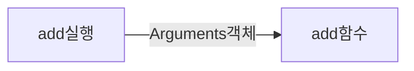

# Function


## 1. 자바스크립트 함수의 역할

자바스크립트는 단순히 클래스의 메서드 정도의 기능 뿐만 아니라, 훨씬 다양한 기능을 수행한다. 

함수의 역할을 살펴보면 아래와 같이 **3가지 기능**으로 볼 수 있다. 

- 호출 가능한 루틴으로서의 함수
- 값으로서의 함수
  - 인자로 전달 가능
  - 변수에 할당 가능
  - 다른 함수의 반환값으로 할당 가능
- 다른 인스턴스를 생성할 수 있는 요소, 즉 객체타입으로서의 함수

우리가 함수를 정의하면 위에서 정의한 역할을 모두 수행할 수 있는 구조가 메모리에 정의된다. 


## 2. 함수 모델링

자바스크립트는 컴파일을 먼저 수행하고나서 실행을 한다. 

```javascript
function add(x, y){
    return x + y;
}
```

위와 같은 함수가 정해지면, 자바스크립트는 우선 컴파일을 실행을 하게 되는데 아래와 같은 구조로 구성된다. 

- 변수 스코프
  - [+] prototype
  - [-] x
  - [-] y
- 실행코드 블록영역
  - return x + y
- 프로토타입 객체
  - [+] constructor
- 공개변수 영역

간단한 함수를 정의했는데도 이렇게 구조가 복잡한 것은, 앞에서 말한 3가지 기능을 모두 수행하기 위해서다. 

어떤 기능을 수행할 지 모르기 때문에 모든 준비를 갖추고 있어야 한다. 


### 변수 스코프


### 실행코드 블록 영역

### 공개변수 영역

### 프로토타입 객체

### 영역 접근 방법


## 3. 함수를 정의하는 3가지 방법

### 함수 정의

### 함수 리터럴

### Function 생성자 사용


## 4. 함수 인자 - arguments, callee

### arguments

```javascript
add(a,b){
    a+b
}
add(1,2);
```




### argument.callee

callee 속성은 현재 실행되고 있는 함수(함수 객체)를 나타낸다.

이것은 마치 생성자 안에서 사용되는 this와 같다. 


### 

## 5. Fuction

### Function vs function

### Function VS. Object, Array


## 6. 함수 객체


## 7. 익명 함수

## 8. 중첩 함수

## 9. 콜백 함수