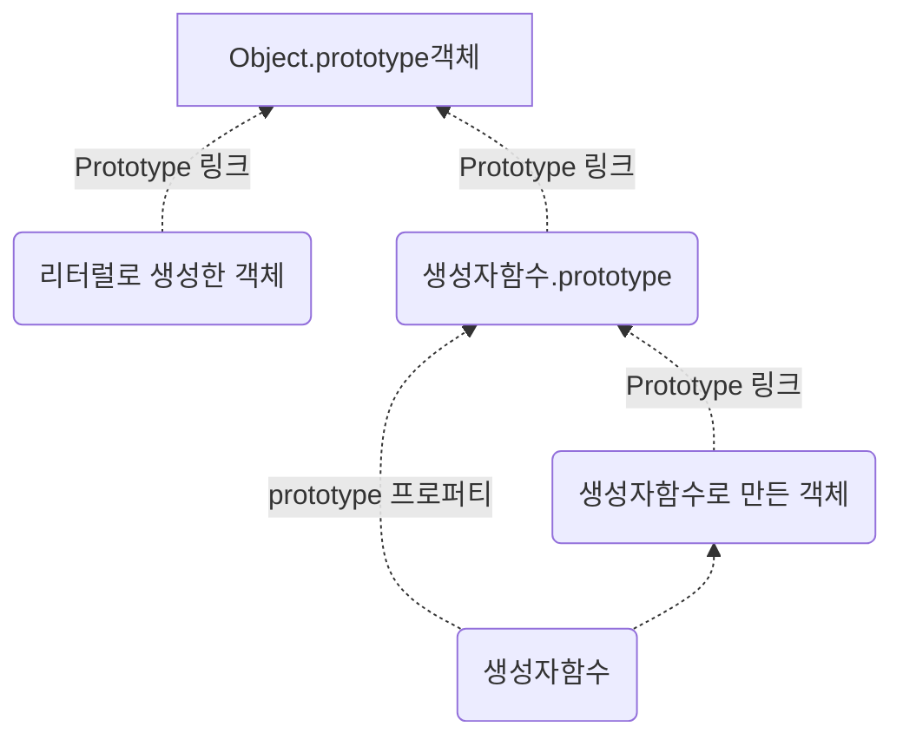

# prototype

자바스크립트에서는 OOP를 prototype 기반으로 구현한다.

다른 언어에서 class에 메소드와 프로퍼티를 선언하는 반면, 자바스크립트는 prototype에 메소드를 작성한다.


1. prototype은 프로퍼티를 연결하는 오브젝트이다. 
2. prototype은 인스턴스 생성 가능 여부 기준이 된다. 
   내장 객체 중에서도 prototype 을 가지지 않은 Math는 new Math() 이런 식으로 객체를 생성하지 못한다. 
   왜냐하면 인스턴스는 prototype에 있는 constructor 로 생성되기 때문이다. 


```javascript
function Human(name){
    this.name = name;
}
```


#### prototype은 함수 선언시에 만들어진다. 

- function 키워드로 선언된, Human이라는 생성자 함수를 만들면, 
- 자바스크립트는 내부적으로 Human의 prototype 객체를 하나 추가적으로 더 만들어낸다. 
- (화살표 함수는 선언시에 프로토타입을 만들지 않는다.)


#### 프로토타입은 상호 참조구조이다.

- 이 prototype은,  constructor 라는 프로퍼티를 갖고 있으며, constuctor는 다시 Human을 참조한다. 
- Human 안에 들어있는 prototype 프로퍼티가 Human의 prototype이라는 걸 가리기고, 
- 또 그 "Human의 prototype" 안에있는 constuctor 가 다시 Human 객체를 가리키는 것을 이해하는 것, 이것이 프로토타입 이해의 출발점이다. 


## `__proto__`

```javascript
function Human(name){
    this.name = name;
}

var foo = new Human('foo');

Human.prototype.sample = 'sampleTxt';
foo.constuctor.prototype.test2 = 'testTxt2';
foo.__proto__.test = 'testTxt';

console.dir(Human);
console.dir(foo);
```

- 일반적으로 Human 이라는 생성자 함수의 prototype에 프로퍼티나 함수를 추가한다. 
- foo에서 Human 생성자 함수의 프로토타입에 프로퍼티나 함수를 추가하려면, foo.constructor.prototype 방식을 사용한다.
- prototype과 `__proto__`는 결국 같은 대상을 가리키는데, 그 대상은 Human의 prototype이다.
- 원시값이 아닌 모든 참조값은 `__proto__`속성을 갖는다.
- 어떤 객체에 프로퍼티가 없다면 프로퍼티를 찾을 때까지  `__proto__` 를 계층적으로 탐색한다.


### 프로토타입은 언제 결정되는가?

- 모든 객체의 프로토타입은, 자바스크립트의 룰에 따라 객체를 생성하는 시점에 결정된다. 


#### 객체 리터럴 방식으로 생성한 경우 

- 객체 리터럴 방식으로 생성 === Object()라는 내장 생성자함수를 통해 만들어진 것
- 따라서  Object()가 생성자가 되며, 프로토타입은 Object.prototype 객체이다. 


## 프로토타입의 세가지 모습

- prototype 프로퍼티(포인터) :  프로토타입을 가리킴. ((생성자)함수 안에 존재) - prototype
- prototype 링크(포인터) : 프로토타입을 가리킴. (생성자 함수를 통해 만들어진 인스턴스에 존재 ) 
  - [[Prototype]] 로 표기, (`__proto__` 로 통칭 사용)
  - 모든 참조타입은 내부적으로 이 값을 다 갖고 있고, 자신의 원형을 가리키고 있다.
- prototype 객체(대상객체) : 얘가 진짜 프로토타입(constructor를 갖고 있다.)


## 프로토타입 링크의 종결점




#### 참고 

- 직접 콘솔로 출력해서 비교해볼 것
- `__proto__`가 없어질때 까지 계속 눌러서 찾아보면 결국 Object 에 도달함.

```javascript
if (true) {
    const a = {
        x: 1,
        y: 2,
    }
    console.dir(a)

    const b = ()=>{
        const x = 1;
        const y = 2;
    }
    console.dir(b)

    function c() {
        this.x = 1;
        this.y = 2;
    }
    console.dir(c)

    const d = function() {
        this.x = 1;
        this.y = 2;
    }
    console.dir(d)

    const e = new Function(1)
    console.dir(e)

    const f = new Date()
    console.dir(f)

    const g = Date;
    console.dir(g)

    const h = new Object();
    console.log(h)

    console.dir({})
}
```


## 기본 프로토타입의 변형

- 기본 프로토타입은 다른 프로토타입 객체로 변형이 가능하다. 
- 기본 프로토타입을 변형하고 나면, 그 이후에 생성되는 객체는 프로토타입 체이닝이 달라진다. 


---


