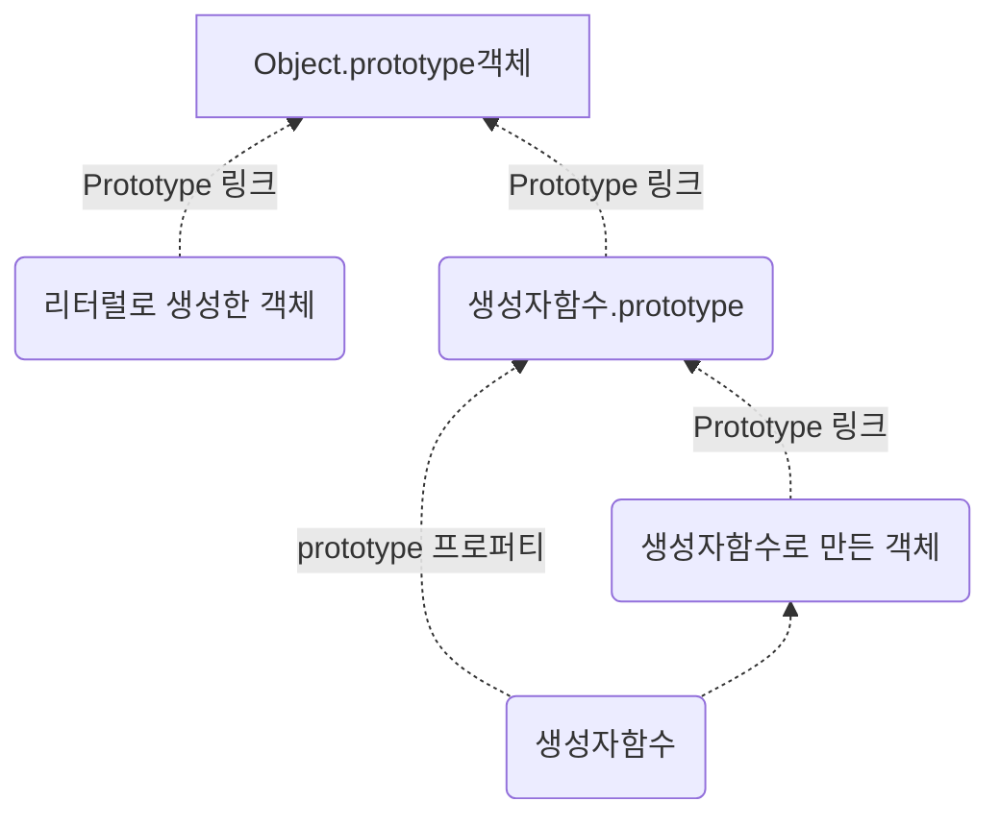

# prototype

```javascript
function Human(name){
    this.name = name;
}

var foo = new Human('foo');

Human.prototype.sample = 'sampleTxt';
foo.constuctor.prototype.test2 = 'testTxt2';
foo.__proto__.test = 'testTxt';

console.dir(Human);
console.dir(foo);
```

- 일반적으로 Human 이라는 생성자 함수의 prototype에 프로퍼티나 함수를 추가한다. 
- foo에서 Human 생성자 함수의 프로토타입에 프로퍼티나 함수를 추가하려면, foo.constructor.prototype 방식을 사용한다.
- prototype과 __proto(언더바 표현이 안된다….)는 결국 같은 대상을 가리키는데, 그 대상은 Human의 prototype이다.


### 프로토타입은 언제 결정되는가?

- 모든 객체의 프로토타입은, 자바스크립트의 룰에 따라 객체를 생성하는 시점에 결정된다. 


#### 객체 리터럴 방식으로 생성한 경우 

- 객체 리터럴 방식으로 생성 === Object()라는 내장 생성자함수를 통해 만들어진 것
- 따라서  Object()가 생성자가 되며, 프로토타입은 Object.prototype 객체이다. 


## 프로토타입의 세가지 모습

- prototype 프로퍼티 :  프로토타입을 가리킴. (생성자 함수 안에 존재) - prototype
- prototype 링크 : 프로토타입을 가리킴. (생성자 함수를 통해 만들어진 인스턴스에 존재 ) [[Prototype]] 로 표기
- prototype 객체 : 얘가 진짜 프로토타입



